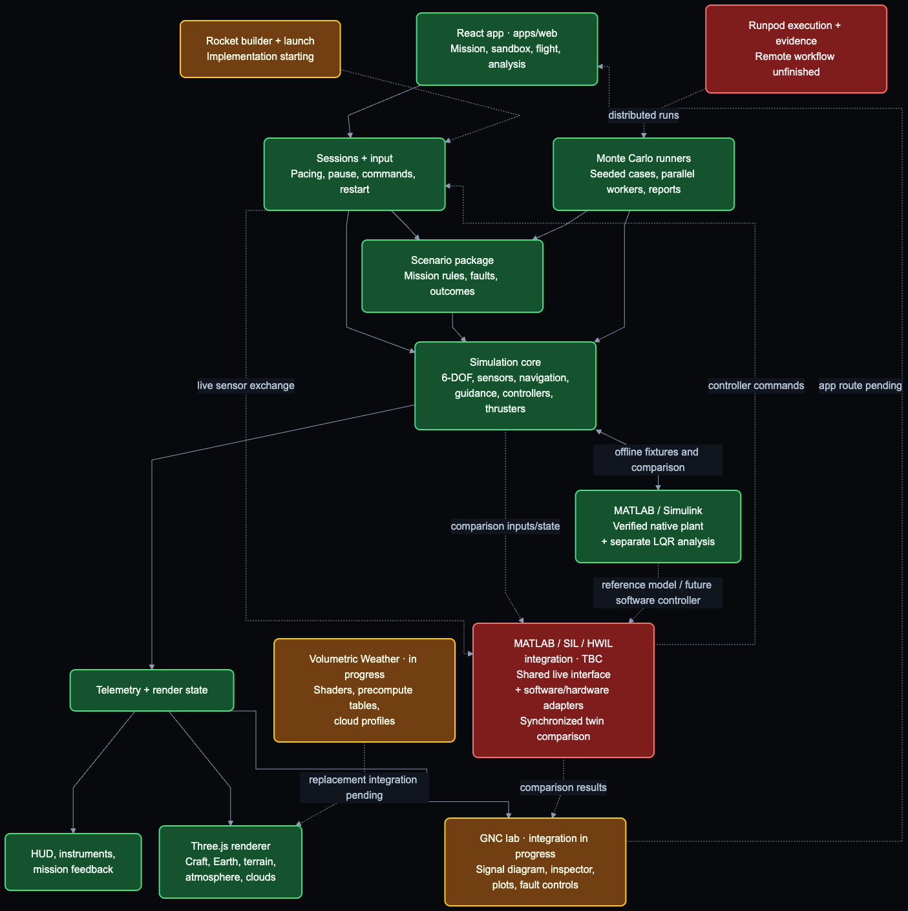

# Orbital Docking GNC Lab

A spacecraft rendezvous and docking simulator that makes guidance, navigation
and control visible. Fly a capsule with manual thruster control, watch a docking
autopilot, or test how navigation and control respond to sensor and thruster faults.

[**Try the simulator**](https://docking-sim.pages.dev/) ·
[Portfolio](https://carlosgonzales.dev/#work) ·
[Architecture](docs/ARCHI.md) ·
[Release history](docs/2-changelog/changelog_table.md)

The release version is **v0.15.0 — Under the Hood**. The development map below also includes work
beyond that release; its colors describe the scope of each block, not deployment status.

## What it demonstrates

| Area | Implementation |
| --- | --- |
| Dynamics | Six degrees of freedom: RK4 integration of Clohessy–Wiltshire relative motion and quaternion rigid-body attitude, with thruster forces, torques and propellant use. |
| Navigation | Seeded sensor measurements, a six-state translation EKF, and an attitude MEKF with gyro-bias estimation and star-tracker updates. |
| Guidance and control | V-bar approach guidance, PID and LQR feedback, constrained MPC for terminal approach, bounded force/torque allocation across 16 thrusters, and corridor/abort monitoring. |
| Verification | Analytical dynamics oracles, conservation checks, statistical filter-consistency tests, deterministic replay and seeded Monte Carlo analysis. |
| Interactive simulation | Guided docking missions, manual flight, telemetry instruments, registered thruster effects, Earth terrain and volumetric clouds. |

**Flight software consumes simulated sensor measurements, not privileged truth.**
The renderer observes the simulation; it does not drive the physics. Dynamics run
at 100 Hz, flight software at 10 Hz, and MPC at 1 Hz, all on simulation time.

## System architecture

Development diagram snapshot: **September 16, 2026**. The release notes below
describe the newer completed increments; the diagram also includes planned work.

**🟢 Done · 🟡 In progress · 🔴 TBC / Not started**

Solid arrows show existing paths. Dashed arrows show unfinished integrations.

[](https://carlosgonzales.dev/#sim-architecture)

[Open the zoomable diagram](https://carlosgonzales.dev/#sim-architecture) ·
[SVG](docs/6-memo/assets/codebase-map.svg) ·
[Mermaid source](docs/6-memo/assets/codebase-map.mmd) ·
[Responsibilities and boundaries](docs/6-memo/codebase-map.md)

Green rendering refers to the existing **Takram baseline**. Its replacement,
**Volumetric Weather**, remains in progress. The offline MATLAB/Simulink plant
and separate LQR analysis are included under `tools/matlab-port`. Live MATLAB / SIL / HWIL integration and
remote Runpod execution remain planned.

## Try it

| Mode | What to do |
| --- | --- |
| [Mission](https://docking-sim.pages.dev/?mode=mission) | Start with the prepared six-metre docking exercise, or select the emergency final-approach scenario. |
| [Sandbox](https://docking-sim.pages.dev/?mode=sandbox) | Watch the autopilot approach or take manual control. |
| [Analysis](https://docking-sim.pages.dev/?mode=analysis) | Run seeded Monte Carlo cases and inspect outcomes, propellant use and time margin. |
| [Flight](https://docking-sim.pages.dev/?mode=flight) | Start on foot beside a parked Hornet at the airfield, then board it. |
| [GNC Lab](https://docking-sim.pages.dev/?mode=gnc) | Inspect the running guidance/navigation/control diagram, step the simulation, plot signals, compare nominal and stuck-thruster cases, and export recorded runs. |

The bare URL opens the first-docking mission. The briefing and in-game controls
overlay explain the active mode.

## Run locally

Use Node.js with the repository's pinned **pnpm 9.12.0**.

```sh
pnpm install --frozen-lockfile
pnpm --filter @docking/web dev --host 127.0.0.1 --port 5174 --strictPort
```

Open [localhost:5174](http://127.0.0.1:5174/). The explicit port avoids taking
5173, and strict port selection prevents silently starting a second server elsewhere.

```sh
pnpm test        # simulation, scenario and web suites
pnpm build       # workspace type checks and production build
```

The web build provisions pinned renderer assets into
`apps/web/public/vendor/takram/` before compiling. Those generated assets are
ignored by Git; the setup script verifies their checksums. See the
[testing guide](docs/4-unit-tests/TESTING.md) for package-specific checks.

## Controls

### Spacecraft

| Input | Action |
| --- | --- |
| `W` / `S` | Pitch down / up |
| `A` / `D` | Yaw left / right |
| `Q` / `E` | Roll left / right |
| `Shift` / `Ctrl` | Translate forward / backward |
| `I` / `K` | Translate up / down |
| `J` / `L` | Translate left / right |
| `M` | Toggle AUTO / MANUAL |
| `T` | Toggle RATE hold / direct PULSE control |
| `G` | Toggle LOW / HIGH manual authority |
| `V` | Cycle PID / LQR / MPC |
| `Backspace` | Command abort |
| `C` | Cycle camera |
| Right-drag / scroll | Orbit / zoom the camera |
| `B` | Toggle debug camera |
| `H` / `?` | Show controls |

The mouse controls the camera; keys control spacecraft rotation. Browser
shortcuts can take priority, particularly `Ctrl+W` when reversing and pitching.
The first-docking lesson restricts expert mode changes and ignores the abort
shortcut; the emergency mission retains it. Precision changes preserve an
explicitly held approach, and retry repeats the selected practice distance.

### Aircraft

`W` / `S` pitch, `Q` / `E` roll, `A` / `D` yaw, and `Shift` / `Ctrl`
raise/lower throttle. Brackets adjust pitch trim. `P` pauses, `R` resets,
and `C` changes camera. Flight pauses when focus is lost. Use
`?mode=flight&start=airborne` for the airborne start.

## Model scope

This is an engineering portfolio simulator, not a validated Crew Dragon or
F/A-18 flight model. Capsule mass, inertia and thruster parameters are simulation
assumptions; mesh registration does not establish real spacecraft engineering data.
CW translation assumes small separation around a circular reference orbit.

The MATLAB verification covers the offline plant, pulse/fault experiments and
separate LQR analysis. It does not establish a live twin, hardware-in-the-loop
operation or a complete MATLAB port of the sensors and flight software.

Aircraft dynamics use approximate aerodynamic coefficients in a local flight
domain: 50 km radius, below 20 km and Mach 0.95. The airfield/on-foot experience
exists, but a runway ground-roll and landing solver is still absent. See the
[flight model notes](docs/6-memo/f18-flight-prototype.md).

## Code organization

| Location | Responsibility |
| --- | --- |
| `packages/sim-core` | Dynamics, sensors, estimation, guidance, control and allocation. Pure TypeScript; no React, Three.js or DOM dependencies. |
| `packages/scenario` | Mission rules, public fault/command injection and Monte Carlo. |
| `apps/web` | React/Vite application, session ownership, input, telemetry, HUD and Three.js rendering. |
| `tools/matlab-port` | Executable MATLAB/Simulink spacecraft plant, pulse/fault experiments, analytical checks and separate LQR analysis. |
| `docs` | Architecture, plans, verification guidance, reviews, engineering notes and release history. |

New contributors should read [ARCHI.md](docs/ARCHI.md) for coordinate frames,
quaternion conventions, units and package boundaries. The project uses the
TRIP workflow: plan, implement, review and release. Detailed version-by-version
changes belong in the [changelog](docs/2-changelog/changelog_table.md).

## Current development

- **GNC Lab:** full session replay and the remaining causal walkthrough; the live diagram, inspector, plots, fault controls and recorded-run import/export are available.
- **Volumetric Weather:** finish the atmosphere/cloud port, source-parity checks and visual acceptance before replacing the current renderer.
- **MATLAB integration:** build the shared live interface for software-in-the-loop execution and synchronized comparison; hardware adapters follow later.
- **Monte Carlo:** complete remote execution and campaign evidence on Runpod.
- **Gameplay:** procedural rocket construction and launch, with clear mission-planning objectives.

The procedural vehicle and ascent dynamics are available as tested core APIs;
this release does not add a rocket builder or a playable launch mission.
Mounted IMU support separates actual sensor installation from assumed calibration;
it does not claim verified Dragon sensor locations. See the
[v0.15.0 usage and scope notes](docs/6-memo/gnc-v0.15.0.md) for local Monte Carlo
commands, the MATLAB entry point and the limits of each delivered feature.

## Build history

Each feature release adds another piece of the simulator. Patch releases keep
the same name; their fixes are recorded in the [full changelog](docs/2-changelog/changelog_table.md).

| Release | Name | What it brought to life |
| --- | --- | --- |
| **v0.15.0** | **Under the Hood** | A view inside the GNC loop: live signals, fault demonstrations, recorded runs, local Monte Carlo tools and the native MATLAB/Simulink plant. |
| **v0.14.0–0.14.3** | **Marlin One** | The first manual docking mission, Crew Dragon thrusters, a Hornet and walkable airfield, and the current space-to-ground environment. |
| **v0.8.0** | **Head in the Clouds** | The first atmosphere, cloud and terrain overhaul, with a debug camera for exploring Earth. That early renderer was later retired. |
| **v0.7.0** | **Feel the Burn** | Selectable manual authority, visible thruster plumes and procedural thruster audio. |
| **v0.6.0** | **Mission Control** | Guided scenarios, a mission switch panel and seeded Monte Carlo analysis. |
| **v0.5.0** | **Home Stretch** | Constrained terminal-approach control, corridor monitoring and passive abort protection. |
| **v0.4.0–0.4.2** | **Full Tilt** | Six-degree-of-freedom attitude, gyro-bias estimation, manual controls and the docking camera. |
| **v0.3.0** | **Baby Steps** | The first real dynamics, sensors, navigation filters, feedback controllers and discrete thrusters. |
| **v0.2.0** | **First Light** | Earth, the station, a capsule and the initial flight display. |
| **v0.1.1** | **On the Pad** | Project structure, architecture conventions and the development workflow. |

## Credits

Aircraft and capsule models, Earth imagery, terrain data and renderer dependencies
retain their original attribution. See [asset sources and licenses](apps/web/public/assets/ASSETS.md).
