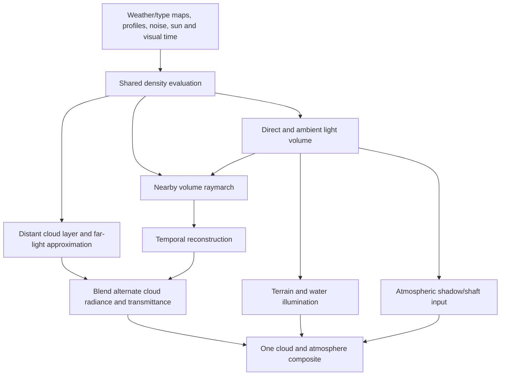

# Modern EVE cloud system implementation plan

Independent Codex plan review: **APPROVED**, 2026-09-07. [Final review](../6-memo/renderer-repair-2026-09-06/eve-plan-review-round2.txt); [initial checkpoint finding](../6-memo/renderer-repair-2026-09-06/eve-plan-review-round1.txt) is resolved below. This is architectural review, not implementation or visual acceptance.

## Overview

Adopt modern EVE's overall cloud-rendering organization as the target: authored weather and cloud types, nearby raymarched volumes, a shared direct/ambient lighting volume, a coordinated distant cloud layer, temporal reconstruction, and explicit atmosphere/surface integration. Three.js remains the web renderer and Takram remains the atmosphere foundation. Existing cloud code is reusable infrastructure where it fits this target; its current feature limits must not dictate the design.

User direction on 2026-09-07 supersedes the earlier recommendation to treat a shared lighting volume and distant representation as optional experiments. These are now required parts of the destination architecture. The user already established scope and constraints: real nearby volumes, modded-KSP quality from orbit through descent, Earth scale, weaker-hardware performance, port 5174, preserved imported work and a Claude handoff. This records the discovery decisions already made in conversation.

Version 0.12.0 is proposed planning metadata, not a release or package-version change. The exact pass-06 tree `22e78a9563b6dce7172d928785478cfd55acbc9f` is now anchored by commit `ffd53b55a4e9a7748720f9d01e5792ea7f97a5a2` on `codex/renderer-pass06-checkpoint`; its tree was independently checked against the recorded hash. Implementation begins in a separate branch/worktree created from that named checkpoint. The running `.render-investigation.local` prototype and the imported checkout's staged source remain preserved. No implementation or visual-parity claim follows from approval of this plan.

## Evidence and reuse boundary

The author documents coverage/type maps, per-type shapes, a volume-to-scaled transition, shared direct/ambient lighting and temporal reconstruction. Modern release-5 configuration changes noise/erosion behavior and supports overlapping layers. We follow those documented responsibilities, while browser-specific algorithms below are our engineering design. [Overview](https://github.com/LGhassen/EnvironmentalVisualEnhancements/wiki/Raymarched-Clouds-Overview), [configuration](https://github.com/LGhassen/EnvironmentalVisualEnhancements/wiki/Raymarched-cloud-configuration), [lighting volume](https://github.com/LGhassen/EnvironmentalVisualEnhancements/wiki/Light-volume-(Release-4)), [reconstruction](https://github.com/LGhassen/EnvironmentalVisualEnhancements/wiki/Temporal-upscaling-and-noise-detiling).

The public EVE `release-5` branch at `9a7786ac05cb4ee15ceb44f0e5151c784fa630d3` supplies cloud-type/phase settings, deferred raymarch orchestration and light-volume scheduling. Translate those responsibilities and configuration semantics where they fit WebGL. This extends the earlier audit of `raymarched-volumetrics` at `ce731021357e2fa3283b1c92a389e4e42a23fada`. Both inspected trees omit core modern GPU kernels, including the referenced raymarch/reconstruction/light-volume implementations. Classic EVE particle shaders do not substitute for them. Therefore this is selective public-source translation plus a browser implementation of the documented system, not a verbatim complete modern-EVE port. Keep exact source hashes, author notices and attribution for any reused file; no dependency on obtaining unavailable modern binaries/source or copying a third-party visual pack. Existing NASA sources and newly authored configurations remain usable. Prior source audit: `docs/6-memo/renderer-repair-2026-09-06/eve-scatterer-dissection.md`; updated inventory: `docs/6-memo/renderer-repair-2026-09-06/eve-v5-reuse.md`.

## Problem statement

Pass 06 fixed compressed-map orientation, water classification, land albedo and normal coverage. Current clouds still turn into a flat/grainy sheet at shallow orbital angles; a three-channel procedural weather candidate is insufficient. Takram 0.7.6 exposes four global layer profiles and one shared shape scale rather than a per-pixel cloud-type table. It already owns Beer shadow maps and temporal passes, so blindly adding a second lighting/composition path would double work or attenuation.

Cold descent stalls occur in both current weather modes (roughly 18–19 minimum interval FPS), while an earlier warm run was much smoother. Their cause is not yet isolated with CPU/GPU profiling. Coarse coastal geometry and imagery remain separate terrain defects; adopting EVE's cloud system does not supply a terrain engine.

## Solution architecture

### Ownership and interfaces

All new cloud modules live under `apps/web/src/scene/clouds/`. `CloudSystem` owns their lifecycle; `LibraryEffects.tsx` remains the only main-view composer owner. Use `cloudSystem=eve` as an explicit development selector until the entire acceptance matrix passes. Current library and structured-candidate selectors remain reproducible reference paths; never run both systems in the same image.

- **WeatherSnapshot:** planet radius/frame, geographic coverage and type textures, per-type parameters, seeded noise, visual time, sun direction and a generation number. Surface, cloud and shadow consumers use the same snapshot. Keep engine north-at-V=1 geographic UVs and the existing ECEF adapter; image storage orientation is handled once at each loader boundary. Preserve the packaged Earth KTX correction.
- **DensitySample:** extinction/scattering coefficients in inverse metres, phase parameters and type mixture at an ECEF location and footprint. One canonical shader module is used by view rays, light rays and far-data preparation. Cloud types interpolate parameters before density evaluation; RGBA coverage channels are not silently treated as cloud-type IDs.
- **CloudLightingSample:** direct solar transmittance and cloud-occluded diffuse-sky irradiance, with validity and generation. The cache stores two scalar factors: sun transmittance and ambient visibility. The adapter combines ambient visibility with the atmosphere's local sky irradiance; this is an explicit approximation to direction-dependent sky occlusion, to be measured against the ambient reference. Direct transmittance is dimensionless; returned irradiance uses the same linear units as the atmosphere LUT. View-dependent phase functions remain with the view ray. This replaces the equivalent stock Beer/ambient terms for participating consumers.
- **CloudViewResult:** premultiplied cloud radiance, view transmittance, representative cloud depth and validity, plus the precise atmosphere-composition convention. The near and far results describe alternatives for the same ray segment. Define terrain occlusion before compositing. Depth uses the repaired logarithmic-depth convention; distances stored in half-float targets must be normalized or kilometre-scaled with paired encoders/decoders.

### 1. Cloud backend and stable extension points

**Files:** `clouds/CloudSystem.ts`, `clouds/CloudBackend.ts`, `clouds/takramCloudBackend.ts`, `LibraryEffects.tsx`.

First prove weather/density and lighting injection into the pinned cloud backend, including primary rays, secondary rays, far data and temporal history. The public package exports `CloudsEffect` but its internal shader/pass classes are not a stable extension API. The implementation must not expand the current scattered string replacements indefinitely.

Use a versioned local fork of the minimum cloud package source needed to expose density, lighting and output hooks; keep it under `clouds/vendor/takram/` with its original MIT notice, pinned version/source manifest and a recorded upstream diff. Preserve Three/Takram atmosphere and existing temporal/depth infrastructure. Import through one backend adapter. Move relevant pass-06 cloud compatibility fixes into this maintained integration boundary and retain their oracles. Do not change `node_modules` in place. If the required subset depends on most of the package, vendor the coherent package subset rather than duplicating private classes piecemeal; record its exact inventory before that implementation step.

A backend conformance fixture must demonstrate zero cloud, a homogeneous slab, overlapping media, valid terrain occlusion and all-consumer density/lighting agreement. This fixture is the first implementation deliverable and determines whether the reused backend supports the target; it is not a new sky renderer.

### 2. Weather, types and shape assets

**Files:** `clouds/cloudConfig.ts`, `clouds/cloudWeather.ts`, `clouds/shaders/cloudDensity.glsl`, `apps/web/scripts/setupEveCloudAssets.mjs`, `apps/web/public/assets/clouds/eve/manifest.json`.

Define a separate coverage map and type field, per-type base/top altitude, independent height-dependent coverage and density curves, primary noise scale, erosion depth and phase parameters. Start with four authored types: broken cumulus, deeper convective formations, stratiform cover and cirrus. Use a finite type table and interpolate adjacent valid type entries; clamp IDs at the loader. Conservative marching and light-grid bounds must include all enabled types and weather displacement, including interpolation between types. V5 uses a richer base noise instead of its earlier separate detail-noise stage.

Use one canonical density evaluator per layer in every consumer. Follow EVE v5's bounded, density-ordered view passes for overlapping layers, with an explicit unique overlap order and shared inter-layer shadowing. Occlusion is approximate; do not claim draw-order independence for this production path. A small combined-medium reference sums extinction/scattering before integration to measure the approximation on overlap fixtures. Light-volume generation accounts for every enabled layer along its ray. [V5 overlap design](https://github.com/LGhassen/EnvironmentalVisualEnhancements/wiki/Overlapping-layers(Release-5)).

Author one reference region with an isolated formation, a broken field, clear gaps and a deep cloud group, then extend globally after those views pass. Derive initial global coverage from the existing pinned NASA source; do not present satellite brightness as measured liquid water. Generate seeded periodic Perlin/Worley noise with explicit periods/lacunarity/persistence and bounded erosion; add deterministic detiling and optional flow coordinates through the same density interface. Match the documented behavior, without claiming EVE's absent exact shader equations. No mandatory rain, lightning, wet-surface effects or in-game painter in this cloud-rendering milestone.

Assets are generated offline with hashes, metadata and reproducible commands. No expensive whole-planet field generation in the render loop or hidden downloads during descent. Snapshot time uses the public simulation elapsed-time seam; use a fixed probe time for A/B scenes. Camera motion and floating-origin rebases must never advect the weather.

### 3. Shared lighting volume

**Files:** `clouds/CloudLightVolume.ts`, `clouds/cloudLightVolumeLayout.ts`, `clouds/shaders/cloudLighting.glsl`.

Use WebGL2 framebuffer rendering into texture-array slices (`WebGLArrayRenderTarget`), not a compute-shader requirement. Render sequential slices or bounded batches; do not attach the entire volume as simultaneous color outputs. Query array-layer, attachment and renderable-format limits. Interpolate explicitly between altitude slices because array layers do not filter along their layer index. Store direct and diffuse-sky quantities separately. Near-light integration handles the fine segment; the cache supplies the disjoint remainder along the sun ray. At a volume sample position, recomputing the same complete path and then multiplying the cache would double the shadow. Tests must enforce the chosen split endpoint.

Start from the public v5 LightVolume host's single camera-oriented volume, horizon-derived placement and bounded movement/resize thresholds. Translate its frame/extent calculations with Earth-scale configuration in place of hard-coded Kerbin tuning. Reconstruct the absent GPU mapping as an explicitly documented paraboloid projection: in the volume frame, map a unit ray by its XY components divided by one plus Z; invert that projection and intersect each altitude sphere to locate a sample. Mark out-of-disc/back-facing cells invalid. The CPU oracle must prove horizon coverage and round-trip positions, including orbit and below-cloud cameras, before shader use. No exact match to EVE's absent GPU warp is claimed; do not add cascades without measured need.

Prototype budgets: one low grid 96×96×16 or medium grid 128×128×24 per lighting quantity. Follow v5's compact storage: direct and ambient occupy disjoint slice ranges of one R16F array, with explicit clamps preventing interpolation across the range boundary. Two complete buffers cost about 1.125 MiB low / 3 MiB medium, before validity/scratch and view/history buffers. If only RGBA16F is renderable, report the fourfold allocation increase and enforce the total cap. Audit fragment texture-unit use alongside render-target memory. The public host uses scalar storage and combined ranges; our factor interpretation still needs analytic validation because its generating shader is absent. [Pinned LightVolume host](https://github.com/LGhassen/EnvironmentalVisualEnhancements/blob/9a7786ac05cb4ee15ceb44f0e5151c784fa630d3/Atmosphere/RaymarchedClouds/LightVolume/LightVolume.cs).

Budget direct and stochastic ambient updates independently by slices. Reuse v5's scheduling responsibilities, with explicit WebGL feedback safety: no texture sampled by a draw may also be its framebuffer attachment. Freeze the generation's weather/time/sun inputs during a bounded build and publish only once its required slices are complete. Coalesce gradual incoming changes for the next generation; do not restart a build every frame. This initial atomic-publication policy is a browser simplification of v5's rolling/reprojected updates. Movement within a valid grid may reuse it; cuts/discontinuities invalidate it. During rebuild, retain old data only where its world mapping and inputs remain valid under a configured maximum lag/error tolerance. Otherwise use bounded direct integration and the far approximation with an explicit valid-coverage mask. No uninitialized texels, artificial clear fallback or stale old-coordinate cache. Context loss/disposal cancels generations and releases targets.

Ground/water direct light queries their own sun path through the cloud layer (including receivers below the cache's minimum cloud height); they must not sample an arbitrary bottom slice at the same horizontal coordinate when the sun is oblique. Cloud diffuse irradiance is a separate term, not direct-shadow multiplication. Atmospheric shafts consume the same transport provider through the integration adapter.

### 4. Distant clouds and representation transition

**Files:** `clouds/DistantCloudPass.ts`, `clouds/cloudTransition.ts`, `clouds/shaders/distantCloud.glsl`.

Implement a curved, lit distant layer from the same weather/type/height definitions, with distant normal/optical-depth detail prepared offline or on weather-generation changes. It may use a reduced height representation, but must provide convincing terminator response, large-scale shadows and silhouette/height cues. A plain white coverage decal does not pass the reference images. Outside valid local light-volume coverage, use a bounded far-light approximation whose inputs and ownership are explicit.

Near/far selection depends on view distance/projected cloud detail and atmosphere altitude, with a shared planet-wide overlap. Determine thresholds from Earth-sized reference captures; do not copy Kerbin distances. Finish the transition inside jointly valid coverage or normalize valid alternative weights. During overlap, blend premultiplied radiance and transmittance for the same ray segment, then composite once. Do not stack two cloud opacities, two full shadows, or different atmosphere treatments. The thin-layer approximation is not mathematically equivalent to a volume; compare grazing rays against a high-quality volume reference and widen/refine the distant representation if its error remains visible.

After a completed handoff, stop scheduling the unused view pass. Keep only lighting work required by active receivers. Transitions must work ascending, descending, looking horizontally, teleporting and moving between camera modes.

### 5. Temporal reconstruction and atmosphere/surface integration

**Files:** `clouds/CloudTemporalState.ts`, `clouds/CloudAtmosphereBridge.ts`, `LibraryEffects.tsx`, `libraryCloudShadowDiagnostics.ts`, `libraryWaterLighting.ts`.

Reuse the existing reconstruction passes through the backend. Track camera pose/projection, viewport/DPR, world-frame rebase transform, weather/light generations, backend and near/far weights as history metadata. Reproject normal camera/rebase motion and compatible gradual updates; do not clear history merely because pose or a generation counter changed. Add history-depth disocclusion testing missing from the stock resolve. Reject history for cuts or incompatible lighting/weather/representation changes; account for weather motion if enabled. Keep a native-resolution/no-history reference mode for grain-versus-ghosting comparisons. Quality settings have finite memory/step/update budgets.

The bridge assigns exactly one owner to sky, surface aerial perspective, cloud radiance and sun/ambient attenuation. The existing atmosphere remains responsible for clear-air transport. Adapt its shadow/shaft input to the shared provider; its existing compressed Beer-shadow texture contract cannot accept a light-volume texture by assignment. Update/fork the bounded atmosphere integration shader seam explicitly and preserve atmosphere LUT generation. Retire equivalent stock cloud shadow/ambient computation when this provider is active.

Main view and docking PiP use separate view/depth/history resources; immutable weather assets and compatible light data can be shared. Preserve opaque water metadata and masked normal coverage. Specify transparent/emissive ordering so plumes, sun and spacecraft do not get shaded as opaque terrain or composited twice. A full renderer default switch requires these views, not just the free-flight probe.

## Performance and cost impact

60 FPS remains the preferred integrated-GPU target; the existing architecture records a user-accepted 30 FPS visual-quality floor. Record actual renderer/backend, device, viewport, DPR and settings before asserting either. Initial bounded cloud allocation caps at 1080p/DPR1: 48 MiB low and 96 MiB medium, including light grids, cloud view/history/depth and noise/weather resources; exclude shared scene/atmosphere targets but report their separate total. Failed allocation or missing renderable float support selects an explicit lower tier/reference backend; no repeated allocation failure loop.

Before tuning ray steps, add CPU timings for terrain selection/build dispatch/uploads, shader compilation/first use and each cloud scheduling phase; use disjoint GPU timer queries where supported, accepting results only when available and not disjoint. No synchronous readbacks in production. Reproduce matched cold/warm descents with and without cloud work. Profile and address the known cold engagement stall independently; similar FPS between weather modes is evidence to investigate, not proof of root cause.

Use bounded warmup and per-frame upload/build budgets only after the profile identifies the blocking work. No promise of beating KSP on weaker hardware follows from EVE's architecture or a single 60-FPS screenshot.

## Files to modify/create

Paths below are relative to the isolated implementation checkout. The list is the planned integration boundary; the vendored dependency inventory is recorded in its manifest in Phase 1.

1. `apps/web/src/scene/clouds/CloudSystem.ts` — orchestrator/lifecycle.
2. `apps/web/src/scene/clouds/CloudBackend.ts` — density, light and view contracts.
3. `apps/web/src/scene/clouds/takramCloudBackend.ts` — sole fork integration.
4. `apps/web/src/scene/clouds/vendor/takram/` — coherent pinned source subset, notice and upstream diff manifest.
5. `apps/web/src/scene/clouds/cloudConfig.ts` — types, quality and shared settings; referenced from `sky/skyConfig.ts`.
6. `apps/web/src/scene/clouds/cloudWeather.ts` — assets/time/generation.
7. `apps/web/src/scene/clouds/shaders/cloudDensity.glsl` — canonical media evaluation.
8. `apps/web/src/scene/clouds/CloudLightVolume.ts` — GPU allocation/update/publication.
9. `apps/web/src/scene/clouds/cloudLightVolumeLayout.ts` — spherical cap coordinate mapping.
10. `apps/web/src/scene/clouds/shaders/cloudLighting.glsl` — shared transport queries.
11. `apps/web/src/scene/clouds/DistantCloudPass.ts` — distant view and far transport.
12. `apps/web/src/scene/clouds/shaders/distantCloud.glsl` — lit curved representation.
13. `apps/web/src/scene/clouds/cloudTransition.ts` — valid overlap and pass scheduling.
14. `apps/web/src/scene/clouds/CloudTemporalState.ts` — per-view history validity.
15. `apps/web/src/scene/clouds/CloudAtmosphereBridge.ts` — atmosphere/surface/shaft ownership.
16. `apps/web/src/scene/clouds/cloudSystem.test.ts` and per-module tests as required by the test impact — analytic and integration oracles.
17. `apps/web/scripts/setupEveCloudAssets.mjs` and `apps/web/public/assets/clouds/eve/manifest.json` — reproducible source assets.
18. `apps/web/src/scene/LibraryEffects.tsx` — one composer and selected cloud system.
19. `apps/web/src/scene/renderProbeConfig.ts` and `RenderProbe.tsx` — selector, named visual fixtures and per-pass measurements.
20. `apps/web/src/scene/libraryCloudShadowDiagnostics.ts` and `libraryWaterLighting.ts` — common lighting provider for existing surfaces.
21. `apps/web/src/scene/DockingCameraPiP.tsx` — separate view integration/history.
22. `apps/web/src/scene/sky/skyConfig.ts` — single-source cloud config reference.
23. `apps/web/src/scene/terrain/TerrainPatches.tsx`, `terrainWorker.ts` — first timing instrumentation; subsequent scheduling changes only supported by captured profile.
24. `apps/web/package.json`, root `pnpm-lock.yaml` and `apps/web/vite.config.ts` — only dependency/build wiring needed for a source fork and shader imports; pin all changes.

No sim-core/scenario internals, new dynamics, terrain replacement or production browser controls are part of this plan. Runtime UI remains the flight UI; detailed render controls remain probe-only.

## Technical considerations and backward compatibility

Keep package purity, public telemetry APIs and SI conventions. The rendering visual clock follows published simulation time without changing physics. Translate Hill/render and ECEF exactly once; float64 CPU coordinates and camera-relative GPU positions remain mandatory. Use deterministic seeded assets. Handle poles, longitude seams, below-cloud receivers, cloud-layer overlap, sun at/below horizon, context loss, viewport change and rapid teleports through explicit tests.

Preserve `codex/renderer-pass06-checkpoint` as the durable rollback ref and verify its tree before starting. Create a new `codex/eve-cloud-system` branch in a separate worktree from that ref; do not implement in the dirty prototype directory or reset the imported checkout. Develop behind `cloudSystem=eve`; earlier library weather modes remain available for comparisons. Migrate or retire superseded cloud adapters after their tests pass against the fork, then remove duplicate rendering paths only after end-to-end acceptance. No merge, publishing or release is authorized merely by writing this plan.

## Test impact

- Preserve existing orientation/depth/normal/water/shadow tests. Add real shader/GPU fixture coverage for changed extension points rather than relying only on shader text matching.
- Analytic oracles: empty media, homogeneous-slab Beer transport, disjoint near/cache path composition, nonnegative bounded direct transmittance, ambient reference integration, combined-medium reference invariance, reversible cap coordinates and valid-cache generation publication. Production overlapping view passes use EVE's documented approximate order; measure their error against that reference, reject tied/unstable configured order and verify shared shadowing.
- Image comparisons at identical weather/time/sun: 400/120/70/20/3/1 km and 50 m; pitch −20/−10 and −45; orbit limb, terminator/night, coast, mountain, cloud entry/exit and clear gaps. Compare near-only, far-only and blended overlap. Both static and moving results must retain shape/shadows without doubled opacity or visible handoff seams.
- Cold/warm 30-second descent and ascent, rapid rebase/teleport, viewport/DPR changes, PiP, transparent effects and a 10-minute resource soak. No default promotion while either the visual matrix or performance floor fails. Record timers/device and report unresolved failures honestly.
- Follow the TRIP implementation test gate for scope; no implementation/test code is included in this plan.

## Documentation impact

- `README.md`: setup and cloud asset command, backend selector and supported rendering configuration.
- `apps/web/public/assets/ASSETS.md`: sources, generated maps, provenance and retained notices.
- `docs/ARCHI.md`: renderer ownership, cloud system, visual-time convention and required shared transport/near-far architecture; original authoritative UV/package boundaries remain.
- `docs/scenario-mode-spec.md`: None; scenario schema/director/public semantics unchanged.
- TRIP handoff: update the current repair README/memo with backend decision, source checkpoint, images, measurements and outstanding items; do not rewrite historical evidence as final acceptance.

## To-dos

### Phase 1 — Implementation seam and measurable baseline

- [x] Anchor/hash pass 06 as a durable named commit/ref without changing the imported index.
- [x] Create a separate implementation branch/worktree from that ref and profile the cold-start stall with per-pass/terrain timings.
- [x] Record direct reuse/notice inventory, create the coherent cloud backend fork and extension contracts.
- [x] Pass empty/slab/overlap/depth fixtures with one atmosphere composition and reproducible poses.

### Phase 2 — EVE-style cloud construction

- [ ] Implement separate weather/type maps and shared density/noise/erosion evaluation.
- [ ] Author the reference region and validate formation structure at orbit, approach and inside clouds.

### Phase 3 — Shared transport and atmosphere bridge

- [ ] Implement bounded cap layouts, light slices, generation publication and fallback queries.
- [ ] Connect cloud, ground/water and atmospheric shaft consumers; retire duplicate direct/ambient terms.
- [ ] Verify below-layer receivers and local/cache path endpoints with analytic and GPU checks.

### Phase 4 — Distant layer and temporal transition

- [ ] Implement lit far clouds and far-shadow fallback with common inputs.
- [ ] Verify valid radiance/transmittance blending and stop unused passes after handoff.
- [ ] Integrate per-view temporal history and test movement, weather changes and rebases.

### Phase 5 — Whole renderer acceptance

- [ ] Verify PiP, transparent/emissive effects, device capability fallback and cleanup.
- [ ] Resolve measured cold-start bottlenecks and run cold/warm/soak measurements.
- [ ] Complete the multi-altitude visual matrix and independent implementation review.
- [ ] Package source/evidence for Claude; promote the selector only after acceptance. Keep failures explicit.
