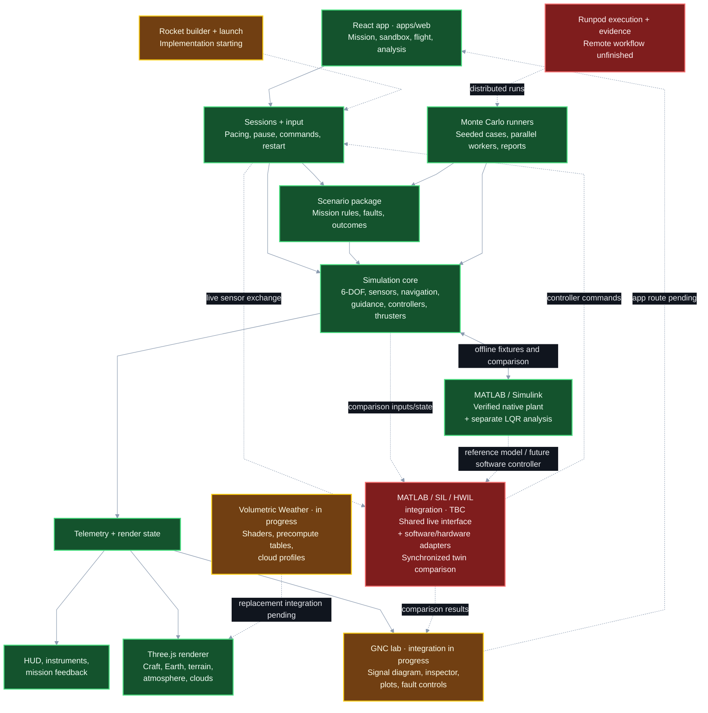

# Codebase map — 2026-09-16

Rough map of the current primary checkout. Solid arrows show existing ownership/data paths; dashed arrows show unfinished integration or port work. No release or whole-system acceptance is implied.

**Status:** 🟢 **Done** · 🟡 **In progress** · 🔴 **TBC**

Colors apply to the scope named in each box. Green rendering means the existing Takram baseline; its Volumetric Weather replacement is yellow. Runpod execution and remote evidence remain TBC; the local Monte Carlo runners are complete.

The red MATLAB / SIL / HWIL integration block reuses the green simulation, telemetry and offline MATLAB model. It groups the shared live interface, software/hardware adapters and synchronized comparison mode; implementation has not started. The green MATLAB box covers the verified offline model only.

## Responsibilities

| Area | Main location | Boundary |
| --- | --- | --- |
| Application and mode ownership | `apps/web/src/App.tsx`, `appModeStore.ts` | Current routes select SANDBOX, MISSION, ANALYSIS or FLIGHT; GNC and launch routes are unfinished. |
| Simulation and flight software | `packages/sim-core/src` | Pure TypeScript with no renderer dependency. FSW consumes sensor data, not privileged truth. Orbital truth runs at 100 Hz, FSW at 10 Hz and MPC at 1 Hz. |
| Mission logic | `packages/scenario/src` | Commands/fault injection through public simulation APIs; mission rules do not read private truth. |
| Session/telemetry bridge | `apps/web/src/telemetry`, `flight`, `gncLab/session` | Each active mode owns its clock/session and publishes state for presentation. Aircraft physics is separate from orbital FSW. |
| Rendering | `apps/web/src/scene` | Three.js owns the visible world. The Takram baseline still runs; Volumetric Weather is being built and verified before replacement. |
| GNC instrumentation | `apps/web/src/gncLab` | Traces/graph/session are implemented; inspector integration approved, plots/fault controls and mounted entry remain in progress. |
| Monte Carlo | `packages/scenario`, `apps/web/src/analysis`, `gncLab/mc`, `tools/gnc-mc-infra` | Browser analysis and headless campaign work exist; remote Runpod orchestration/evidence completion is separate. |
| MATLAB companion | `tools/matlab-port` | Native plant, executable Simulink pulse experiments and separate LQR analysis were executed and verified. Full sensors/FSW and a live SIL link are not included in that result. |
| MATLAB / SIL / HWIL integration | Planned: `apps/web/src/gncLab/sil`, `tools/gnc-bridge`; later hardware-specific adapter | Share signal definitions, run identity, clock ownership, command validation and evidence logging. SIL connects a software controller; HWIL supplies a hardware adapter, target GNC software and suitable timing host. Twin comparison is an optional synchronized reference/analysis mode within this integration. Live implementation and hardware verification are TBC; the browser/local bridge alone is not a hard-real-time host. |

The core feedback loop is **dynamics → simulated sensors → navigation estimate → guidance/control → thruster allocation → actual forces and torques → dynamics**. Rendering observes the result and does not provide physical feedback.

Within the external integration, **SIL and HWIL select where the controller executes; twin mode selects whether a second model runs for comparison**. Reuse the interface and evidence machinery across these options. Privileged comparison truth goes to the reference/analysis path, not to the controller's sensor input.

Reference: `docs/ARCHI.md`, current `App.tsx`, F015/F016/F019/F020 plans and `tools/matlab-port/VERIFICATION.md`. Dashed features must not be presented as already running.
