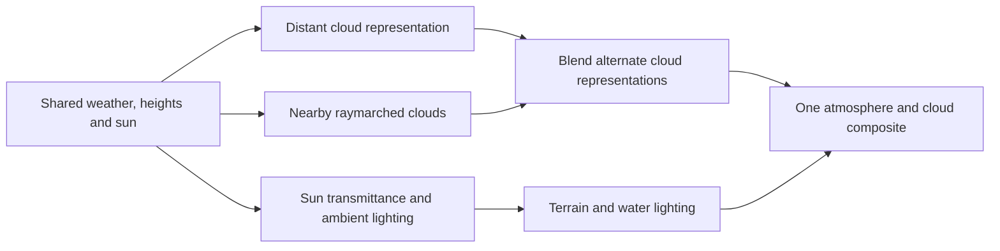

# EVE and Scatterer: source dissection and direction

2026-09-06 Pacific. Two parallel Codex agents traced the public repositories;
the parent inspected key shader/pass code, the author's documentation and our
installed Takram implementation. This is source research, not a KSP benchmark.

## Evidence boundary

| Material | Inspected revision | Available evidence |
| --- | --- | --- |
| Classic EVE | `4ac5793a55dec05d6dba70237dde8a2f0d68f855` | Shell, particle, shadow and compositor source |
| EVE raymarched branch | `ce731021357e2fa3283b1c92a389e4e42a23fada` | Supplementary host/configuration code; the referenced core raymarch shader was absent from the inspected public tree |
| Scatterer | `c2d0b0f2a8798381040d3a4e735a00cad957eb47` | C# integration and older shaders, not all current distributed shader implementations |
| EVE author wiki | Accessed 2026-09-06; observed HEAD `598e8ab280894ae5a49293b216ce68fad1683841` | Documented modern behavior, with release-specific differences |
| Our prototype | Takram clouds 0.7.6, atmosphere 0.19.1 | Actual local capabilities and integration gaps |

Scatterer's README explicitly excludes shaders after 0.0772. EVE's public
raymarched host looks up `EVE/RaymarchCloud`; finding the host does not reveal
the missing density, lighting or reconstruction shader. No binaries were
decompiled. [Scatterer boundary](https://github.com/LGhassen/Scatterer/blob/c2d0b0f2a8798381040d3a4e735a00cad957eb47/Readme.md),
[EVE raymarched host](https://github.com/LGhassen/EnvironmentalVisualEnhancements/blob/ce731021357e2fa3283b1c92a389e4e42a23fada/Atmosphere/RaymarchedClouds/CloudsRaymarchedVolume.cs#L301-L331).

## Classic EVE: inexpensive distant clouds and local particles

The distant layer is a textured shell at cloud altitude. `Clouds2D` normally
builds a camera-facing hemisphere and moves it between scaled and local space.
Its shader adds detail textures, bump lighting, terminator treatment and
distance/rim fades. It does not integrate a volume along the viewing ray.
[Shell construction](https://github.com/LGhassen/EnvironmentalVisualEnhancements/blob/4ac5793a55dec05d6dba70237dde8a2f0d68f855/Atmosphere/Clouds2D.cs#L173-L190),
[shell shader](https://github.com/LGhassen/EnvironmentalVisualEnhancements/blob/4ac5793a55dec05d6dba70237dde8a2f0d68f855/Assets/Shaders/SphereCloud.shader#L159-L242).

Nearby classic “volumetrics” are a recentered particle field. A geometry shader
expands points into billboard quads with rounded-looking shading. Particle and
shell fades conceal the handoff; additional rim/depth terms mean the transition
is not an exact conservation of opacity. The unified-camera compositor renders
particles at half width and height, then uses depth to choose samples near
foreground silhouettes. This older spatial upsampling is distinct from modern
raymarch temporal reconstruction.
[Particle expansion](https://github.com/LGhassen/EnvironmentalVisualEnhancements/blob/4ac5793a55dec05d6dba70237dde8a2f0d68f855/Assets/Shaders/GeometryCloudVolumeParticle.shader#L248-L329),
[recentered field](https://github.com/LGhassen/EnvironmentalVisualEnhancements/blob/4ac5793a55dec05d6dba70237dde8a2f0d68f855/Atmosphere/VolumeSection.cs#L159-L203),
[compositor](https://github.com/LGhassen/EnvironmentalVisualEnhancements/blob/4ac5793a55dec05d6dba70237dde8a2f0d68f855/Assets/Shaders/CompositeDeferredClouds.shader#L57-L122).

Classic local screen-space shadows reconstruct a receiver from depth, follow the sun direction to
the cloud sphere, sample coverage/detail at that intersection, and darken the
framebuffer. This gives geometric shadow displacement without marching through
cloud density. The scaled/orbital path instead uses a projector and receiver
geometry. These are approximations, not volumetric extinction. Shells,
particles and shadows share weather/planet transforms so moving the camera does
not move the weather. EVE's UV axes differ from ours and must not be copied
without conversion.
[Shadow shader](https://github.com/LGhassen/EnvironmentalVisualEnhancements/blob/4ac5793a55dec05d6dba70237dde8a2f0d68f855/Assets/Shaders/ScreenSpaceCloudShadow.shader#L91-L141),
[shared transforms](https://github.com/LGhassen/EnvironmentalVisualEnhancements/blob/4ac5793a55dec05d6dba70237dde8a2f0d68f855/Atmosphere/Clouds2D.cs#L398-L419).

## Modern EVE: real volumes with deliberate approximations

The author describes global coverage and cloud-type maps combined with 3D noise.
Coverage grows/shrinks formations rather than merely changing alpha. Different
types supply different shapes and heights. The overview explicitly warns that
satellite coverage alone looks flat and uniform, recommending added structure.
The volume and distant layer can use different maps; matching their appearance
remains a configuration responsibility.
[Author's overview](https://github.com/LGhassen/EnvironmentalVisualEnhancements/wiki/Raymarched-Clouds-Overview).

Modern configuration explicitly provides a volume-to-scaled-layer altitude
fade, adaptive ray steps, local lighting samples and adjustable scattering phase
functions. Light-volume effects can fade into old 2D shadows at their distance
limit. This supports the proposed hybrid approach, but establishes neither
exact thresholds for our planet nor physical equivalence of both representations.
Some overview pages retain restrictions that release 5 relaxes, such as layer
overlap; read the release-specific configuration alongside them.
[Raymarched configuration](https://github.com/LGhassen/EnvironmentalVisualEnhancements/wiki/Raymarched-cloud-configuration).

A shared light volume supplies large-scale shadows and ambient lighting across
layers. Horizontal detail concentrates near the camera; vertical slices span
the active layers. The grid adjusts to movement/altitude, and direct/ambient
updates can be spread across frames. Nearby light marches retain fine detail.
Scatterer can consume the volume for atmospheric light shafts. These are
documented mechanisms, not recovered modern shader equations.
[Light volume](https://github.com/LGhassen/EnvironmentalVisualEnhancements/wiki/Light-volume-(Release-4)).

Temporal upscaling is documented as the main raymarch optimization: compute
parts of the image across frames and reproject history for motion. Quality
tradeoffs remain, especially near the horizon. Optional distance fields skip
empty coverage areas, but the author says their benefit is scene-dependent and
can be negative. No general weak-hardware performance conclusion follows.
[Temporal reconstruction](https://github.com/LGhassen/EnvironmentalVisualEnhancements/wiki/Temporal-upscaling-and-noise-detiling),
[distance-field limits](https://github.com/LGhassen/EnvironmentalVisualEnhancements/wiki/Signed-Distance-Fields-(Release-4)).

## Scatterer: transport tables and explicit composition

The preprocessor schedules transmittance, irradiance, initial scattering and
higher-order work, then saves an atlas. Expensive atmospheric transport is moved
out of normal frames. Our Takram atmosphere already uses Bruneton's precomputed
scattering approach; this research does not justify replacing it.
[Scatterer precomputation](https://github.com/LGhassen/Scatterer/blob/c2d0b0f2a8798381040d3a4e735a00cad957eb47/scatterer/Effects/Proland/Atmosphere/Preprocessing/AtmoPreprocessor.cs#L360-L388),
[Bruneton reference](https://ebruneton.github.io/precomputed_atmospheric_scattering/).

Separate sky, scaled-planet and local depth-based passes have explicit ownership.
Local scattering can run with one-quarter as many pixels and reconstruct against
full-resolution depth. EVE materials receive shared atmosphere inputs through a
bridge. Custom ocean scattering has separate ownership that changes during the
orbital transition. Physical parameters coexist with artistic exposure, tint and
cloud-light multipliers. This is careful integration of approximations, not a
single universal physical volume.
[Reduced-resolution path](https://github.com/LGhassen/Scatterer/blob/c2d0b0f2a8798381040d3a4e735a00cad957eb47/scatterer/Effects/Proland/Atmosphere/Utils/ScreenSpaceScatteringContainer.cs#L154-L181),
[cloud integration](https://github.com/LGhassen/Scatterer/blob/c2d0b0f2a8798381040d3a4e735a00cad957eb47/scatterer/Effects/Proland/Atmosphere/SkyNode.cs#L1380-L1397),
[ocean ownership](https://github.com/LGhassen/Scatterer/blob/c2d0b0f2a8798381040d3a4e735a00cad957eb47/scatterer/Effects/Proland/Atmosphere/SkyNode.cs#L495-L514).

## Our actual implementation

| Area | Current prototype | Practical gap |
| --- | --- | --- |
| Atmosphere | Takram precomputed transport and one aerial composite | Integration/material correctness, not another atmosphere engine |
| Clouds | Raymarching nearby and from orbit | Distant representation remains an untested optimization |
| Weather | One red-channel global mask drives low cloud and cirrus; globally fixed height bands | Too little variety in cloud structure |
| Shadows | Volumetric Beer maps, now fitted to the physical horizon | Coarse distant maps and differing cascade density LOD |
| Temporal sampling | Existing reconstruction with rebase/footprint repairs | Stronger averaging previously smeared detail |
| Water | Constant diffuse albedo in library mode | No sky reflection/water BRDF; shadowed sea level remains too dark |

Local source: `LibraryEffects.tsx`, `libraryCloudWeather.ts`,
`libraryCloudFootprint.ts`, `libraryCloudShadowRange.ts`,
`libraryCloudShadowStorage.ts`, and `terrain/terrainShaders.ts` under
`.render-investigation.local/apps/web/src/scene/`. The installed library already
provides weather channels, layer profiles, noise, Beer shadows and temporal
reconstruction. [Takram capabilities](https://github.com/takram-design-engineering/three-geospatial/tree/main/packages/clouds).

## Recommended experiments — engineering inference

Keep Three/Takram. Make these changes separately so regressions are attributable:

1. **Finish materials.** Keep the confirmed shadow/depth repairs. Add a supported
   reflection/specular path for water and verify terrain albedo/normals. Assign
   one atmosphere owner per material. Exposure should not conceal broken lighting.
2. **Improve weather data first.** Separate low broken cloud, taller formations
   and cirrus using existing channels/profile parameters, with controlled
   intermediate-scale structure. Visibility and shadows sample the same fields.
3. **A/B a distant cloud layer and shadow approximation.** Use the same weather,
   cloud heights and sun as nearby volumes. Preserve curvature and directional
   lighting, and measure grazing-angle error against the raymarch; shared inputs
   do not make a thin layer equivalent to a volume. A flat white decal would
   keep the current appearance problem. Choose fade distances from projected
   detail and cost on our Earth-sized planet, not KSP's stock thresholds.
4. **Blend alternatives before composition.** Blend premultiplied cloud radiance
   and transmittance in valid overlapping coverage, then composite once. Both
   inputs must either precede atmosphere or include identical atmosphere
   treatment. Finish the handoff inside the overlap, or renormalize valid
   weights; missing map coverage must not count as an artificial clear sample.
   Do not stack two complete cloud
   opacities or multiply two full shadows while fading. Cloud sun transmittance
   affects direct illumination; ambient lighting needs a separate model. This
   is our proposed contract, not a claim about EVE's core raymarch shader absent
   from the inspected public tree.
5. **Profile before adding another lighting cache.** EVE's light volume is a
   useful reference, but putting one beside Takram's existing shadow system could
   duplicate cost. First measure the simpler distant path and each pass's cost.
   Any new cache needs explicit consumer ownership, compatible density/units,
   and invalidation for weather motion, sun changes, rebasing and grid movement.
   Performance gains cannot excuse stale shadows or double attenuation.

Acceptance needs the actual pitch -20/-10 degree orbital views, steeper land
views, cloud entry/exit, sea level, night and a moving descent. Hold resolution,
DPR, sun and weather fixed; compare cloud and shadow on/off separately. Measure
GPU pass cost where supported: a capped 60 FPS does not show GPU headroom.
Neither KSP parity nor better weak-hardware performance has been established.

Independent advisory review retained this direction and added the overlap,
grazing-error and cache-invalidation requirements above. A separate EVE
attribution check corrected the local/projected-shadow distinction and limited
the missing-shader statement to the public tree actually inspected.

## Handoff and reuse boundary

No EVE/Scatterer code or artwork was incorporated into the app. Scatterer's
plugin declares GPLv3 with separately credited components; classic EVE's default
notice is MIT with exceptions. Modern shader permissions were not established.
Review applicable notices before concrete reuse. The immediate output here is
an architecture/source map, not a direct Unity port.
[Scatterer notices](https://github.com/LGhassen/Scatterer/blob/c2d0b0f2a8798381040d3a4e735a00cad957eb47/license.md),
[EVE notices](https://github.com/LGhassen/EnvironmentalVisualEnhancements/blob/4ac5793a55dec05d6dba70237dde8a2f0d68f855/README.md#L18-L48).

For Claude: preserve the imported staged state and read
[the shadow increment](cloud-shadows.md), its patch/manifest and the source links
above. The isolated prototype runs on **5174** with `?renderer=library`; **5173**
is reserved. Start with bounded material/weather experiments, then compare a
distant representation against the existing raymarch. Do not turn this research
into an unconditional renderer rewrite.
